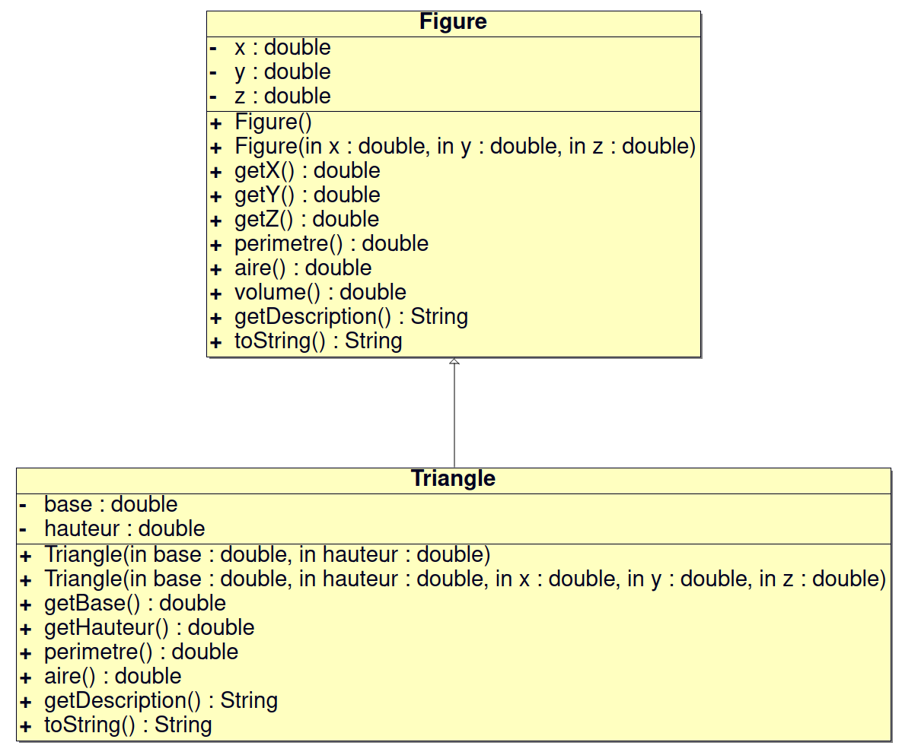
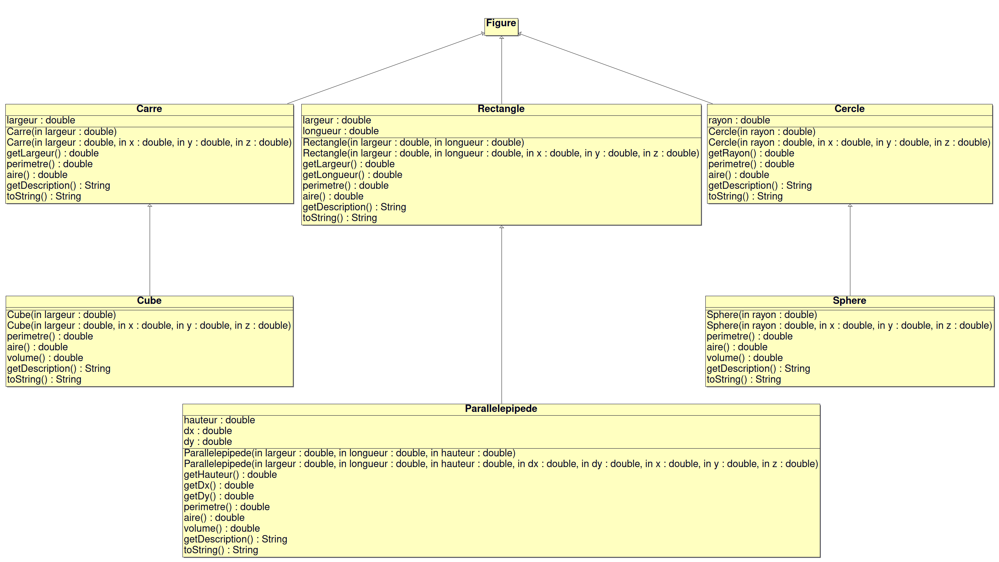
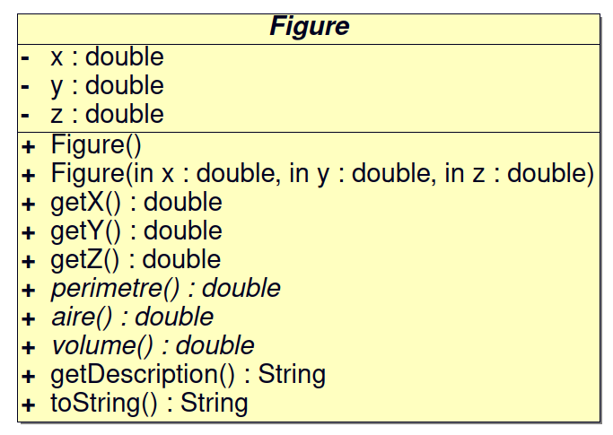
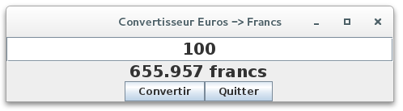

 

# TP POO : Java

- [TP POO : Java](#tp-poo--java)
  - [Introduction](#introduction)
  - [Installation Java SE Development Kit](#installation-java-se-development-kit)
  - [Travail demandé](#travail-demandé)
    - [Séquence n°1 : Avant toute chose... Hello world!](#séquence-n1--avant-toute-chose-hello-world)
    - [Séquence n°2 : Instructions de base](#séquence-n2--instructions-de-base)
    - [Séquence n°3 : Les chaînes de caractères](#séquence-n3--les-chaînes-de-caractères)
    - [Séquence n°4 : POO et héritage](#séquence-n4--poo-et-héritage)
    - [Séquence n°5 : Paquetage et archive](#séquence-n5--paquetage-et-archive)
    - [Bonus : Progammation GUI (Swing)](#bonus--progammation-gui-swing)
  - [Annexes](#annexes)
    - [Tests unitaires : JUnit et Gradle](#tests-unitaires--junit-et-gradle)
    - [VSCode](#vscode)
    - [Bac à sable et développement en ligne](#bac-à-sable-et-développement-en-ligne)
    - [Substitution de Liskov (_Liskov Substitution Principle_)](#substitution-de-liskov-liskov-substitution-principle)

Le but de ce TP est de mettre en oeuvre les éléments de base du langage Java.


> Pour les enseignants, ceci est un devoir pour [Github Classroom](https://btssn-lasalle84.github.io/guides-developpement-logiciel/guide-classroom.html). Il montre l'utilisation des tests unitaires en Java, la notation automatique et l'insertion d'un badge pour l'affichage de la note.

## Introduction

**Java** est le nom d’une technologie mise au point par **Sun Microsystems** (racheté par **Oracle** en 2010) qui permet de produire des logiciels indépendants de toute architecture matérielle. Cette technologie s’appuie sur différents éléments qui, par abus de langage, sont souvent tous appelés Java :

- Le **langage de programmation orienté objet Java** ;
- Un programme compilé en _bytecode_ Java s’exécute dans un environnement d'exécution Java (JRE) qui émule une machine virtuelle, dite machine virtuelle Java (JVM) ;
- La plate-forme Java correspond à la machine virtuelle Java à laquelle sont adjointes diverses spécifications d’API :
    - Java Platform, Standard Edition (Java SE) contient les API de base et est destiné aux ordinateurs de bureau ;
    - Java Platform, Enterprise Edition (Java EE) contient, en plus du précédent, des API orientées entreprise et est destiné aux serveurs ;
    - Java Platform, Micro Edition (Java ME) est destiné aux appareils mobiles tels que assistants personnels ou smartphones ;
    - JavaFX, une API d'interfaces utilisateurs pour Java ;

> Ne pas confondre le langage de programmation de scripts JavaScript avec Java !

**JRE** (_Java Runtime Environement_) est le kit destiné au client pour pouvoir exécuter un programme Java. Il se compose essentiellement d'une **machine virtuelle Java (JVM)** capable d'exécuter le _bytecode_ et les bibliothèques standard de Java.

Le kit destiné au programmeur, appelé avant **JDK** (_Java Development Kit_) et renommé depuis la version 1.2.2 en **SDK** (_Standard Development Kit_), est composé d'un JRE, d'un compilateur, de nombreux programmes utiles, d'exemples de programmes Java et des les sources de toutes les classes de l'API.

Si Java est déjà installé sur le poste, sa version peut être vérifiée en ligne de commande par :

```sh
$ java -version
$ javac -version
```

Sinon, il faudra l'installer.

## Installation Java SE Development Kit

Sous __Ubuntu__, il est possible d'installer :

- la version par défaut de la distribution

```sh
$ sudo apt install --assume-yes --install-recommends default-jdk
```

- une version version supportée par la distribution

```sh
$ sudo apt-get install openjdk-X-*
```

> `X` représente le numéro de version du JDK, `11` sur une Ubuntu 20.04 LTS.

Vérification :

```sh
$ java -version
$ javac -version
```

Plusieurs versions de Java peuvent cohabiter, il est alors possible de configurer la version par défaut :

```sh
$ sudo update-alternatives --config java
$ sudo update-alternatives --config javac

$ java -version
$ javac -version
```

> Il est aussi possible de télécharger des versions spécifiques de [Java SE Development Kit](http://www.oracle.com/technetwork/java/javase/downloads/) sur le site d'[Oracle](http://www.oracle.com/technetwork/java/javase/downloads/). La version `17` est actuellement la dernière version disponible.

## Travail demandé

### Séquence n°1 : Avant toute chose... Hello world!

Éditez le fichier `HelloWorld.java` du répertoire `sequence1` dont le contenu sera le suivant :

```java
public class HelloWorld
{
    public static void main (String[] args)
    {
        System.out.println("Hello world!");
    }
}
```

Cette application Java est quasiment la plus simple qu’il soit possible d’écrire. Elle consiste à afficher le message « Hello world! » sur la console.

Une application Java nécessite d’être **compilée** pour pouvoir être **exécutée** ultérieurement.

Cette opération s’effectue à l’aide de la commande `javac`.

1. En vous plaçant dans le répertoire `sequence1`, exécutez la commande `javac` sans paramètre pour obtenir l’aide en ligne.

```sh
$ cd sequence1
$ javac
Usage: javac <options> <source files>
...
```

2. Compilez ensuite la classe `HelloWorld` et vérifiez qu’un fichier `.class` a bien été produit dans le même répertoire.

```sh
$ javac HelloWorld.java
ls -l *.class
-rw-rw-r-- 1 tv tv 426 janv. 16 10:16 HelloWorld.class
```

3. Vérifiez son type avec la commande `file`.

```sh
$ file HelloWorld.class
HelloWorld.class: compiled Java class data, version 55.0
```

4. Exécutez le programme avec la commande `java`.

```sh
$ java HelloWorld
Hello world!
```

5. Créez maintenant deux sous-répertoires dans `sequence1` que vous appellerez `src` et `build`. Déplacez le fichier `HelloWorld.java` dans `src` et, en utilisant l’option `-d` de `javac`, faites en sorte que le fichier `.class` soit produit dans `build`.

```sh
$ rm HelloWorld.class
$ mkdir ./src ./build
$ mv HelloWorld.java ./src
$ javac -d ./build ./src/HelloWorld.java
$ ls -l ./build/
-rw-rw-r-- 1 tv tv 426 janv. 16 10:18 HelloWorld.class
```

> Il est dans certains cas utile (notamment lorsque l’on transmet l’application via le réseau) de regrouper au sein d’une archive l’ensemble de classes d’une application ou d’une librairie. Une telle archive a en Java un format normalisé et se dénomme un `jar` (_java archive_). Un outil éponyme (i.e. du même nom) permet d’archiver des classes.

```sh
$ cd build/
$ jar cvf hello.jar *.class
manifeste ajouté
ajout : HelloWorld.class(entrée = 426) (sortie = 289)(compression : 32 %)
$ ls -l *.jar
-rw-rw-r-- 1 tv tv 741 janv. 16 10:21 hello.jar
$ file hello.jar
hello.jar: Java archive data (JAR)

$ java -classpath hello.jar HelloWorld
Hello world!
```

Il existe un test unitaire noté pour ce programme :

```sh
$ gradle test

> Task :test

TestHelloWorld > testHelloWorldWorld() PASSED
```

> Voir l'annexe [Gradle](#gradle) si vous souhaitez exécuter les tests en local.

Prêt pour l'aventure Java : « Vers l'infini, et au-delà ! »

### Séquence n°2 : Instructions de base

> Cet exercice est extrait du livre « Exemples en Java in a Nutshell ».

2a. Compléter le programme Java `FizzBuzz` qui, pour tous les entiers de **1 à 100**, affiche sur la console :

```sh
1
2
3
4
5 -> Fizz
6
7 -> Buzz
8
...
97
98 -> Buzz
99
100 -> Fizz
```

Le code source `FizzBuzz.java` à compléter est situé dans le répertoire `sequence2a/src`. La méthode statique `afficheFizzBuzz(int n)` affiche :

- `Fizz` si l’entier `n` est multiple de `5`,
- `Buzz` si l’entier `n` est multiple de `7`,
- `FizzBuzz` si l’entier `n` est multiple de `5` et de `7`,
- la valeur de l’entier `n` sinon.

Il existe un test unitaire noté pour ce programme :

```sh
$ gradle test

> Task :test

TestFizzBuzz > testNoneFizzBuzz() PASSED

TestFizzBuzz > testBuzz() PASSED

TestFizzBuzz > testFizz() PASSED

TestFizzBuzz > testFizzBuzz() PASSED
```

Il est possible de gérer la fabrication d'un programme Java avec `make`. Un petit `Makefile` de base :

```Makefile
SRC=./src

all: FizzBuzz

FizzBuzz: $(SRC)/FizzBuzz.class
	@java -classpath $(SRC) FizzBuzz

$(SRC)/FizzBuzz.class: $(SRC)/FizzBuzz.java
	javac -d $(SRC) $(SRC)/FizzBuzz.java

clean:
	rm -f $(SRC)/*.class $(SRC)/*~
```

> Cet exercice est extrait du livre « Exercices en Java ».

2b. Écrire un programme `TableauCarre` qui crée et affiche un tableau comportant les valeurs des carrés des `n` premiers nombres entiers **impairs**. `n` sera défini sous forme d’une constante `NB_VALEURS` égale à `5`.

Résultat attendu :

```sh
1 a pour carre 1
3 a pour carre 9
5 a pour carre 25
7 a pour carre 49
9 a pour carre 81
```

Éléments de correction :

- Lors de la déclaration d’un tableau, on ne spécifie pas la taille : `char[] tab;` ou `char tab[];` par exemple pour un tableau de `char`
- Le tableau n’existera qu’après l’appel au constructeur : `tab = new char[10];` par exemple pour 10 `char`
- Les constantes se définissent avec `final static`

Il existe un test unitaire noté pour ce programme :

```sh
$ gradle test

> Task :test

TestTableauCarre > testTableauCarre() PASSED
```

Bonus : Adapter le fichier `Makefile` pour :

- avoir une `TARGET`
- fabriquer la `TARGET` dans le répertoire `build`

### Séquence n°3 : Les chaînes de caractères

Le but de cette séquence est de s’exercer à la manipulation de chaînes de caractères.

3a. Inversion de chaîne

Définissez une classe `StringUtils` et ajoutez-y une méthode de signature : `String inverse(String s)` permettant d’inverser les caractères d’une chaîne (i.e. si la chaîne paramètre est "pipo", la méthode retourne "opip").

Écrire une classe `Inverse` qui affiche la chaîne reçue en paramètre et la chaîne inversée. Le programme n'affiche rien et se termine si il ne reçoit aucune chaîne en argument.

Résultat attendu :

```sh
$ java Inverse
$ java Inverse pipo
pipo
opip
```

Éléments de correction :

- :warning: Il est interdit d'instancier un objet de la classe `StringUtils` !
- :warning: Il est interdit de réaliser une saisie dans le programme
- Pour accéder à un caractère de la chaîne `s` à la position `pos` : `s.charAt(pos)`
- Autre possibilité en utilisant un `StringBuffer` (ou `StringBuilder`) et sa méthode `reverse()`

Il existe un test unitaire noté pour ce programme :

```sh
$ gradle test

> Task :test

TestInverse > testMain1() PASSED

TestInverse > testMain2() PASSED

TestInverse > testInverse() PASSED
```

3b. Palyndrome

Reprendre la classe `StringUtils` et ajoutez une méthode de signature : `boolean estPalyndrome(String s)` permettant de tester si une chaîne de caractères
(on ignorera la présence d’espaces en début et fin de chaîne) est un palyndrome (i.e. elle se lit à l’envers comme à l’endroit, comme par exemple "o" ou "tot").

Résultat attendu :

```sh
$ java Palyndrome
Saisie : papa
papa : false
Saisie : pap
pap : true
Saisie : 0
$ 
```

Écrire une classe `Palyndrome` qui prend la chaîne de caractères à tester sur l’entrée standard (_stdin_).

Éléments de correction :

- Utilisez la méthode `inverse()` créée à l’exercice précédent !
- :warning: Pour tester l’égalité entre deux chaînes, il faut utiliser la méthode `equals()` de la classe `String`
- Pour la saisie, utilisez un `BufferedReader` et sa méthode `readLine()` ou un `Scanner`
- La classe `BufferedReader` nécessite un `InputStreamReader` et le flot d’entrée `System.in`
- Pour les classes `BufferedReader` et `InputStreamReader`, il faut spécifier avec le mot-clé `import` avec le nom complet de chaque classe
- L’utilisation de la méthode `readLine()` peut générer une exception `IOException`, il faut donc soit l’intégrer dans un bloc `try/catch` ou que la méthode `main()` relance les exceptions avec `throws IOException` dans sa définition

Compléter la classe `Palyndrome` qui prend la chaîne de caractères à tester sur l’entrée standard jusqu’à la saisie de la valeur entière `0`. Ajouter une méthode publique statique `lireInt()` qui retourne la conversion d’un `String` (lu au clavier) en `int` si c’est possible sinon la valeur `-1`.

Éléments de correction :

- Utilisez la méthode `Integer.parseInt()` pour convertir un `String` en `int`
- La méthode `Integer.parseInt()` génère une exception `NumberFormatException` qu’il faudra attraper avec un bloc `try/catch`

Il existe un test unitaire noté pour ce programme :

```sh
$ gradle test

> Task :test

TestPalyndrome > testLireInt() PASSED

TestPalyndrome > testPalyndrome() PASSED
```

### Séquence n°4 : POO et héritage

Le but de cette séquence est de se familiariser avec la programmation orientée objet en Java.

On désire réaliser un programme orienté objet en Java qui fournit une hiérarchie de classes destinées à mémoriser ou manipuler les propriétés de différentes figures géométriques.

> Lien : l'[Héritage](https://docs.oracle.com/javase/tutorial/java/IandI/subclasses.html) en Java

4a. On propose de traiter au moins le cas des rectangles, cercles, triangles, carrés, sphères, parallélépipèdes rectangles, cubes, ... mais cette liste n’est pas limitative.

Chaque classe devra permettre de mémoriser les données qui permettent de définir une instance, par exemple la longueur des deux cotés d’un rectangle, le rayon de la sphère, etc. Chaque instance devra disposer quand cela a un sens :

- d’une méthode `double perimetre()` qui renvoie la valeur du périmètre de l’instance sur laquelle on l’appelle ;
- d’une méthode `double aire()` qui renvoie l’aire de la surface de l’objet concerné ;
- d’une méthode `double volume()` qui renvoie le volume de la forme concernée.

On considérera que lorsque ces trois notions ne sont pas définies mathématiquement, alors la valeur renvoyée sera **nulle**. Par exemple, le volume d’un carré sera nul, et le périmètre d’une sphère également.

On vous fournit la classe de base `Figure` :

```java
public class Figure
{
    private double x;
    private double y;
    private double z; //coordonnées du centre

    // Constructeur par défaut
    public Figure()
    {
        this.x = 0.;
        this.y = 0.;
        this.z = 0.;
    }

    // Constructeur d'initialisation
    public Figure(double x, double y, double z)
    {
        this.x = x;
        this.y = y;
        this.z = z;
    }

    // Accesseurs
    public double getX()
    {
        return this.x;
    }

    public double getY()
    {
        return this.x;
    }

    public double getZ()
    {
        return this.x;
    }

    public double perimetre()
    {
        return 0.;
    }

    public double aire()
    {
        return 0.;
    }

    public double volume()
    {
        return 0.;
    }

    // Services
    public String getDescription()
    {
        return "Figure";
    }

    @Override
    public String toString()
    {
        return this.x + " " + this.y + " " + this.z;
    }
}
```

On vous fournit la classe `Triangle` qui hérite de la classe `Figure` :

```java
public class Triangle extends Figure
{
    private double base;
    private double hauteur;

    // Constructeurs
    public Triangle(double base, double hauteur)
    {
        super();
        this.base = base;
        this.hauteur = hauteur;
    }

    public Triangle(double base, double hauteur, double x, double y, double z)
    {
        super(x, y, z);
        this.base = base;
        this.hauteur = hauteur;
    }

    public double getBase()
    {
       return this.base;
    }

    public double getHauteur()
    {
        return this.hauteur;
    }

    @Override
    public double perimetre()
    {
        return Math.sqrt(this.base * this.base + this.hauteur * this.hauteur) + this.base + this.hauteur;
    }

    @Override
    public double aire()
    {
        return this.base * this.hauteur / 2;
    }

    @Override
    public String getDescription()
    {
        return super.getDescription() + " <|--- Triangle";
    }

    @Override
    public String toString()
    {
        return super.toString() + " " + this.base + " " + this.hauteur;
    }
}
```



Remarques :

- Pour que la classe `Triangle` **hérite** (dérive) de la classe `Figure`, il faut utiliser le mot-clé `extends`, par exemple : `public class Triangle extends Figure`
- Si un constructeur d’une classe dérivée appelle un constructeur d’une classe de base, il doit obligatoirement s’agir de la première instruction du constructeur et ce dernier est désigné par le mot-clé `super`.
- L'annotation `@Override` indique au compilateur que la méthode qui suit est la redéfinition d'une méthode de la superclasse et qu'il doit assurer cette vérification (https://docs.oracle.com/javase/7/docs/api/java/lang/Override.html).
- La méthode `toString()` est définie dans la classe `Object` (toutes les classes Java en héritent). La méthode `toString()` de la classe `Object` renvoie par défaut le nom de la classe de l'objet concerné suivi de l'adresse de cet objet. Lorsqu'on définit une classe, il peut être très utile de redéfinir la méthode `toString()` afin de donner une description adaptée des objets de cette classe. Beaucoup de classes de l'API redéfinissent cette méthode.

> La classe `Object` est la racine (la classe mère) de la hiérarchie des classes Java. Chaque classe a `Object` comme  superclasse. Tous les objets, y compris les tableaux, implémentent les méthodes de cette classe.

Un programme d'exemple :

```java
public class ExempleFigures
{
    public static void main (String[] args)
    {
        Triangle triangle = new Triangle(5, 8);
        System.out.println(triangle.getDescription());
        System.out.println(triangle); // appel de la méthode toString()
        System.out.println("Périmetre = " + triangle.perimetre());
        System.out.println("Aire = " + triangle.aire());
        System.out.println("Volume = " + triangle.volume());

        // etc...
   }
}
```

On obtient :

```sh
$ java ExempleFigures
Figure <|--- Triangle
0.0 0.0 0.0 5.0 8.0
Périmetre = 22.4339811320566
Aire = 20.0
Volume = 0.0
```

On vous demande d’écrire les classes `Carre`, `Rectangle`, `Cercle`, `Cube`, `Parallelepipede` et `Sphere` et de faire fonctionner le programme de test fourni.



> Mathématiquement, un carré est un rectangle et un héritage aurait pu être implémenté entre les deux classes. Mais cela pose un problème (cf. [violation du principe de substitution de Liskov en Annexe](#substitution-de-liskov-liskov-substitution-principle)) qui dépasse le cadre de ce TP.

Pour information, voici les résultats obtenus pour les calculs des périmètres, aires et volumes des différentes figures :

```sh
$ make
javac -classpath ./src -d ./src ./src/ExempleFigures.java
Figure <|--- Triangle
0.0 0.0 0.0 5.0 8.0
Périmetre = 22.4339811320566
Aire = 20.0
Volume = 0.0

Figure <|--- Carre
0.0 0.0 0.0 5.0
Périmetre = 20.0
Aire = 25.0
Volume = 0.0

Figure <|--- Rectangle
0.0 0.0 0.0 5.0 4.0
Périmetre = 18.0
Aire = 20.0
Volume = 0.0

Figure <|--- Cercle
0.0 0.0 0.0 2.0
Périmetre = 12.566370614359172
Aire = 12.566370614359172
Volume = 0.0

Figure <|--- Carre <|--- Cube
0.0 0.0 0.0 6.0
Périmetre = 0.0
Aire = 216.0
Volume = 216.0

Figure <|--- Rectangle <|--- Parallelepipede
0.0 0.0 0.0 5.0 4.0 9.0 0.0 0.0
Périmetre = 0.0
Aire = 202.0
Volume = 180.0

Figure <|--- Cercle <|--- Sphere
0.0 0.0 0.0 3.0
Périmetre = 0.0
Aire = 113.09733552923255
Volume = 113.09733552923255

...
```

Exemple d'utilisation d'un conteneur en Java :

```java
import java.util.ArrayList; // Voir aussi LinkedList, HashMap, HashSet
import java.util.List; // l'interface List

public class ExempleFigures
{
    public static void main (String[] args)
    {
        // ...

        // Conteneur
        List<Figure> figures = new ArrayList<Figure>();
        figures.add(triangle);
        figures.add(carre);
        figures.add(rectangle);
        figures.add(cercle);
        figures.add(cube);
        figures.add(parallelepipede);
        figures.add(sphere);

        afficherFigures(figures);
   }

   private static void afficherFigures(List<Figure> figures)
   {
        // Solution 1
        for (int i = 0; i < figures.size(); i++)
        {
            System.out.println(figures.get(i).getDescription());
            System.out.println(figures.get(i));
        }
        System.out.println("");

        // Solution 2
        for(Figure figure : figures)
        {
            System.out.println(figure.getDescription());
            System.out.println(figure);
        }
    }
```

4b. Les classes abstraites

En programmation orientée objet (POO), une classe abstraite est une classe dont l’implémentation n’est pas complète et qui n’est donc pas instanciable (on ne peut pas créer d’objet à partir de cette classe).

Une classe abstraite sert de base à d’autres classes dérivées (héritées). Le mécanisme des classes abstraites permet de définir des comportements (méthodes) qui devront être implémentés dans les classes filles, mais sans fournir elle-même ces comportements (c’est-à-dire sans écrire de code pour cette méthode). Ainsi, on a l’assurance que les classes filles respecteront le contrat défini par la classe mère abstraite. Ce contrat est une interface de programmation.

On décide que la classe `Figure` de notre exemple précédent soit une **classe abstraite**. Les méthodes `perimetre()`, `aire()` et `volume()` seront aussi abstraites dans la classe `Figure`.

> On ne pourra plus instancier d'objets de type `Figure` ! D'autre part, l'ensemble des classes qui héritent de la classe `Figure` devront définir les méthodes `perimetre()` , `volume()` et `aire()`.

Éléments de correction :

- une classe abstraite est déclarée avec le modificateur `abstract`
- une méthode abstraite est déclarée avec le modificateur `abstract` : elle ne contient pas de corps, mais elle doit être implémentée dans les sous-classes non abstraites

Modifier le code source des classes produites à la séquence précédente.

En UML, une classe abstraite sera indiquée par son nom écrit en _italique_ ainsi que toutes ses méthodes abstraites :



4c. Les interfaces

En Java, une interface est un concept de classe abstraite "poussée à l'extrème" (une expression de pure conception) où aucun élément d'implémentation n'est défini.

Une interface comporte simplement :

- Des déclarations de constantes
- Des signatures de méthodes (obligatoirement publiques)

Une interface ne peut pas comporter :

- De déclarations d' attributs
- D'implémentations de méthodes

> La notion d'[Interface](https://docs.oracle.com/javase/tutorial/java/IandI/createinterface.html)

:warning: On ne peut pas instancier d'objet à partir d'une interface.

On dit qu'une classe **implémente une interface** si et seulement si elle définit l'implémentation de toutes les méthodes de
l'interface. Une interface exprime un **contrat**.

> Les méthodes doivent avoir strictement la même signature. L'annotation `@Override` peut (doit) être utilisée.

Le principe est le suivant :

```java
public interface A
{
    public void foo(Object produit);
}

public class B implements A
{
    @Override
    public void foo(Object o)
    {
        System.out.println(o);
    }
}
```

On décide que la classe abstraite `Figure` de notre exemple précédent ne possède plus les méthodes abstraites `perimetre()`, `aire()` et `volume()` car cela oblige toutes les classes filles à les fournir même si cela n'a aucun sens (le `return 0` de certaines méthodes `volume()`). En effet, les figures "2D" n'auront jamais de calcul de volume.

On décide de créer deux interfaces :

- `Calcul2D` qui déclarera les méthodes `perimetre()` et `aire()`
- `Calcul3D` qui déclarera la méthode `volume()`

Et donc :

- les classes `Triangle`, `Carre`, `Rectangle` et `Cercle` implémenteront l'interface `Calcul2D`
- les classes `Cube`, `Parallelepipede` et `Sphere` implémenteront l'interface `Calcul3D`

Élément de correction :

- Une classe peut hériter d'une autre classe (`extends`) **et** implémenter une interface (`implements`).

Modifier le code source des classes produites à la séquence précédente.

:warning: Il vous faudra modifier que le code source `ExempleFigures.java`

### Séquence n°5 : Paquetage et archive

Le but de cette séquence est de se familiariser avec les paquetages et archive _jar_.

Un paquetage (_package_) est une unité logique renfermant un ensemble de classes ayant un lien (fonctionnel) entre elles. Il est désigné par un nom unique et défini un espace de nommage qui permet d’éviter les conflits de noms.

On utilise l’instruction `package monpaquet;` en tout début d’un fichier définissant une classe pour indiquer que celle-ci fait partie du package nommé `monpaquet`.

:warning: toutes les classes compilées faisant partie du paquetage doivent maintenant être présentes dans un répertoire nommé `monpaquet`.

Ajouter l’instruction `package figures;` en tout début de fichier pour chaque classe de cette séquence.

Créer l’arborescence suivante : `sequence5/src/figures` et `sequence5/build/figures` et placez les fichiers sources `*.java` dans `sequence5/src/figures`.

Ensuite, on compile et on exécute de la manière suivante dans `./sequence5` :

```sh
$ javac -d ./build -sourcepath ./src/figures -classpath ./build src/figures/Carre.java src/figures/Cercle.java src/figures/Cube.java src/figures/Figure.java src/figures/Parallelepipede.java src/figures/Rectangle.java src/figures/Sphere.java src/figures/Triangle.java src/figures/ExempleFigures.java

$ java -classpath ./build figures.ExempleFigures
```

L’option `-classpath` (ou la variable d’environnement `CLASSPATH`) contient une liste de chemins conduisant à des répertoires (contenant des classes ou des arborescences de paquetages) et/ou des archives _jar_. Lors de la compilation et de l’exécution, cette variable sert à localiser les fichiers `.class` nécessaires à l’édition de lien.

On peut aussi regrouper l’ensemble des classes dans un fichier d’archive `.jar` :

```sh
$ cd build

$ jar cvf figures.jar figures/*.class

$ java figures.ExempleFigures -classpath figures.jar
```

`jar` est un outil distribué avec le JDK de Java qui permet de compresser des classes Java compilées dans une archive.

Il est également possible d’exécuter directement une application contenue dans une archive _ja_r avec l’option `-jar` de la commande `java`. Pour ce faire, il faut cependant avoir ajouté à l’archive un fichier de méta-données que l’on appelle **manifest** indiquant quelle est la classe principale de l’archive.

```sh
$ cd build
$ vim manifest
Main-Class: figures.ExempleFigures
$ jar cvmf manifest figures.jar figures/*.class
$ java -jar figures.jar
```

### Bonus : Progammation GUI (Swing)

Le but de cette séquence est de se familiariser avec la bibliothèque graphique **Swing**.

Swing, une bibliothèque graphique pour Java, offre la possibilité de créer des interfaces graphiques identiques quel que soit le système d’exploitation.

> Avec l’apparition de Java 8, **JavaFX** devient la bibliothèque graphique officielle du langage Java, pour toutes les sortes d’application (applications mobiles, applications sur poste de travail, applications Web), le développement de son prédécesseur Swing étant abandonné (sauf pour les corrections de bogues).

Le programme suivant est un “hello world” en Swing :

```java
import javax.swing.JFrame;
public class TestJFrame1
{
    public static void main(String[] args)
    {
        JFrame fenetre = new JFrame();

        //Définit un titre pour notre fenêtre
        fenetre.setTitle("Hello World !");

        //Définit sa taille : 400 pixels de large et 100 pixels de haut
        fenetre.setSize(400, 100);

        // ou :
        // Attribut une taille minimale à la fenêtre
        //fenetre.pack();
        //Centre la fenêtre
        fenetre.setLocationRelativeTo(null);

        //Terminera le processus lorsqu’on clique sur la croix rouge
        fenetre.setDefaultCloseOperation(JFrame.EXIT_ON_CLOSE);

        //Et enfin, la rendre visible
        fenetre.setVisible(true);
    }
}
```


Écrire une application Java **Convertisseur** qui assure la conversion euros -> francs :



## Annexes

### Tests unitaires : JUnit et Gradle

[Gradle](https://gradle.org/) est un moteur de production fonctionnant sur la plateforme Java.

> C’est un outil comparable `make`, ou `ant` et `Maven` pour Java.

Non obligatoire pour ce TP, [Gradle](https://gradle.org/) est utilisé seulement pour fabriquer et exécuter les tests unitaires. Vous devez l'installer en local pour pouvoir tester unitairement vos exercices.

Lien : https://gradle.org/install/

> Le paquet fourni par les distributions Ubuntu est trop ancien. Il ne faut pas l'installer.

- Solution 1 : installation manuelle (ici en _root_)

```sh
$ wget -c https://services.gradle.org/distributions/gradle-7.6-bin.zip
$ sudo mkdir /opt/gradle
$ sudo unzip -d /opt/gradle gradle-7.6-bin.zip
$ sudo ln -s /opt/gradle/gradle-7.6/bin/gradle /usr/local/bin
$ gradle -- version
```

- Solution 2 : installation avec `snap`

```sh
$ snap install --classic gradle
$ gradle -- version
```

[JUnit](https://fr.wikipedia.org/wiki/JUnit) est un _framework_ de test unitaire pour le langage de programmation Java, créé par Kent Beck et Erich Gamma.

```sh
$ cat build.gradle
```
```txt
plugins {
	id 'java'
}

repositories {
	mavenCentral()
}

dependencies {
	testImplementation('org.junit.jupiter:junit-jupiter:5.6.0')
}

sourceSets {
  main {
    java {
       srcDirs = ['src']
    }
  }
  test {
    java {
      srcDirs = ['test']
    }
  }
}

test {
	useJUnitPlatform()
	testLogging {
		events "passed", "skipped", "failed"
	}
}
```

Exemple :

```sh
$ cd sequence1
$ gradle test

> Task :test

TestHelloWorld > testHelloWorldWorld() PASSED
```

### VSCode

Evidemment, il existe de nombreuses extensions pour Java pour [Visual Studio Code](https://code.visualstudio.com/).

Lien : https://code.visualstudio.com/docs/languages/java

Le pack [Extension Pack for Java](https://marketplace.visualstudio.com/items?itemName=vscjava.vscode-java-pack) installera les extensions suivantes :

- Language Support for Java by Red Hat : https://marketplace.visualstudio.com/items?itemName=redhat.java
- Debugger for Java : https://marketplace.visualstudio.com/items?itemName=vscjava.vscode-java-debug
- Test Runner for Java : https://marketplace.visualstudio.com/items?itemName=vscjava.vscode-java-test
- Maven for Java : https://marketplace.visualstudio.com/items?itemName=vscjava.vscode-maven
- Project Manager for Java : https://marketplace.visualstudio.com/items?itemName=vscjava.vscode-java-dependency
- Visual Studio IntelliCode : https://marketplace.visualstudio.com/items?itemName=VisualStudioExptTeam.vscodeintellicode

Dans la plupart des projets, les dépendances de bibliothèques tierces en Java sont gérées traditionnellement par [Maven](https://maven.apache.org/) ou [Gradle](https://gradle.org/). Il existe une extension pour Gradle :

- Gradle for Java : https://marketplace.visualstudio.com/items?itemName=vscjava.vscode-gradle

Une fois les extensions Java installées, il est possible d'utiliser le raccourci `Ctrl-espace`.

### Bac à sable et développement en ligne

Il est souvent nécessaire de passer par un "bac à sable".

> En informatique, le bac à sable (_sandbox_) est une zone d'essai permettant d'exécuter des programmes en phase de test ou dans lesquels la confiance est incertaine. C'est notamment très utilisé en sécurité informatique pour sa notion d'isolation.

Il existe de nombreux sites web qui fournissent des EDI (Environnement de Développement Intégré) en ligne pour tester du code ou des services : un espace d'apprentissage séparé. Ils permettent aussi d'échanger des exemples.

Quelques sites :

- Coding Ground For Developers : https://www.tutorialspoint.com/codingground.htm pour tout !
    - **Java : https://www.tutorialspoint.com/compile_java_online.php**
- Visual Studio Code Online : https://vscode.dev/
- Gitpod : https://www.gitpod.io/
- Codeanywhere (Cloud IDE) : https://codeanywhere.com/

### Substitution de Liskov (_Liskov Substitution Principle_)

Le [principe de substitution de Liskov](https://fr.wikipedia.org/wiki/Principe_de_substitution_de_Liskov) (_Liskov substitution principle_) est une définition particulière de la notion de sous-type, formulé par Barbara Liskov et Jeannette Wing.

Une instance de type `T` doit pouvoir être remplacée par une instance de type `G` (un sous-type de `T`) sans que cela ne modifie la cohérence du programme.

> « Les sous-types doivent être substituables à leur type de base. » -- Robert C. Martin

Exemple : en POO, un carré est-il un rectangle ?

- Soit une classe **abstraite** `Figure`
- Soit une classe `Rectangle` représentant les propriétés d'un rectangle : `hauteur`, `largeur`. On lui associe donc des accesseurs pour accéder et modifier la `hauteur` et la `largeur` librement. On définit la règle "hauteur" et "largeur" sont librement modifiable (`setLargeur()` et `setLongueur()`).
- Soit une classe `Carre` que l'on fait dériver (aka hériter) de la classe `Rectangle`. En effet, mathématiquement, un **carré est un rectangle**. Donc, on définit naturellement la classe `Carre` comme **sous-type** de la classe `Rectangle`. On définit la règle "les 4 cotés du carré doivent être égaux" ???

On devrait pouvoir utiliser une instance de type `Carre` n'importe où un type `Rectangle` est attendu.

Problème : Un carré ayant par définition quatre cotés égaux, il convient de restreindre la modification de la hauteur et de la largeur pour qu'elles soient toujours égales. Néanmoins, si un carré est utilisé là où, comportementalement, on s'attend à interagir avec un rectangle, des comportements incohérents peuvent subvenir : Les cotés d'un carré ne peuvent être changés indépendamment, contrairement à un rectangle. Une mauvaise solution consisterait à modifier les _setter_ du carré pour préserver l'invariance de ce dernier. Mais ceci violerait la règle des _setter_ du rectangle qui spécifie que l'on puisse modifier `hauteur` et `largeur` indépendamment.

Comment implémenter les membres de la classe `Carre` ?

C'est une violation du principe de substitution de Liskov : le « carré cesserait d'être un carré » si nous appelions `setLargeur()` (l'attribut `longueur` ne serait plus égal à l'attribut `largeur`). Il faudrait donc modifier l'attribut `hauteur` mais alors le « carré serait différent d'un rectangle ».

Solution : elle consiste à ne pas considérer un type `Carre` comme substitut d'un type `Rectangle`, et les définir comme deux types complètement indépendants. Ceci ne contredit pas le fait qu'un carré soit un rectangle. La classe `Carre` est un représentant du concept "carré". La classe `Rectangle` est un représentant du concept "rectangle". Or, les représentants ne partagent pas les mêmes propriétés que ce qu'ils représentent.

---
Thierry Vaira : **[thierry(dot)vaira(at)gmail(dot)com](thierry.vaira@gmail.com)**
